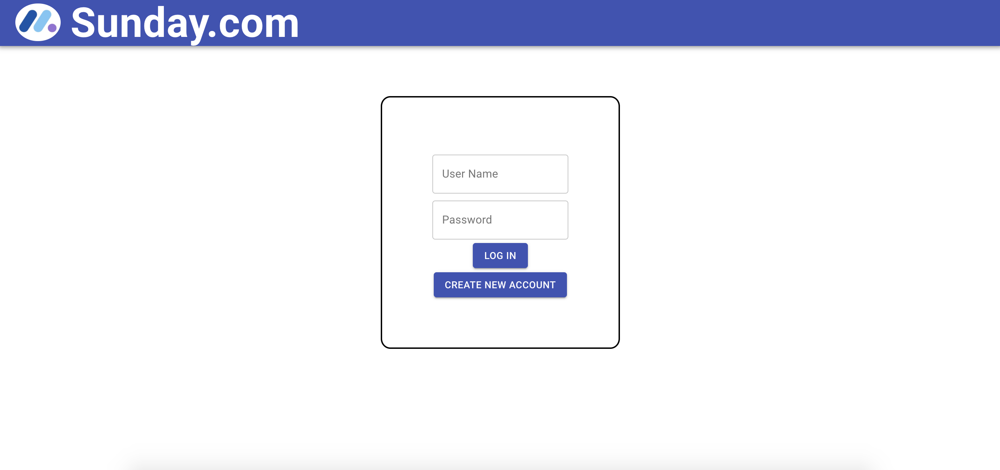
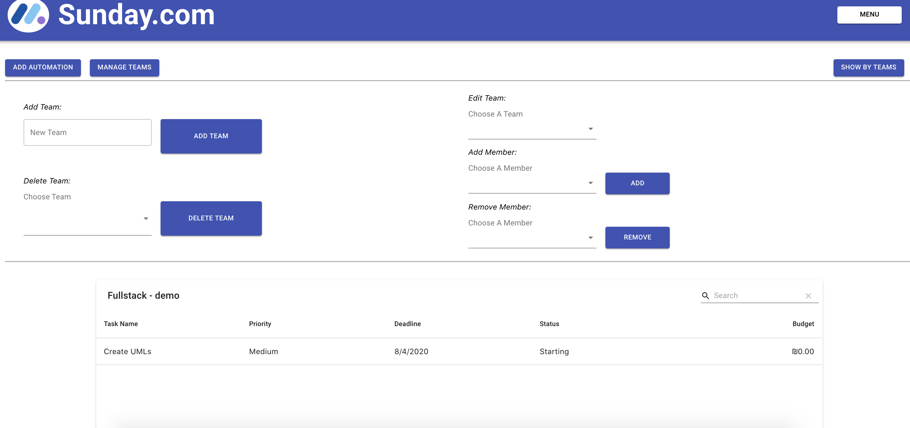

# Sunday

Sunday is a project management system for individuals and teams, giving users the ability to orgenize theirs tasks and enhance their workflow with automations and built in chat.
Sounds familiar ? I can neither confirm nor deny ;)

Demo: [https://sundayy.herokuapp.com/](https://sundayy.herokuapp.com/)

## Table Of Contents
- [Sunday](#Sunday)
  * [My Experience](#MyExperience)
  * [Running the project](#running-the-project)
  * [Tech Stack](#tech-stack)
  * [Screenshots](#screenshots)
    + [Login](#Login)
    + [Sign Up](#Sign-Up)
    + [My Tasks](#My-Tasks) 
    + [Team Tasks](#Team-Tasks) 
    + [Chat](#Chat) 

## My Experience
  This is a group project I did collaborating with GitHub and managing it with trello, I was the team leader.

  My goal with this project was to present all my new skills into a big large scale project, and off course - to learn new skills. Working with this group, and leading it, was a teaching experience. 

  Honestly? I am not happy with all parts of the project, regarding UI/UX and actually mini bugs, but i'm currently working on fixing them and obviously there's always more to learn.

## Running the project
  Preferably check the demo link :)

  User Name: demo

  Password: 1234

  Otherwise:

  1. Clone the repo.
  2. Run `npm install`.
  3. Run `npm run build`
  4. Run `npm start`.
  5. Navigate to `http://localhost:3200`.

## Tech stack
1. React, MobX, Material-UI and Axios.
2. Express (Node.js), SQL (Sequelize), Socket.io, nodemailer, Des-ECB Algorithm. 

## Screenshots

### Login

Login in page - validates inputs with db. db is encrepted with Des-ECB Algorithm. 

For demo usage use:

 User Name: demo

  Password: 1234

  

 

### Sign Up

  Sign Up form - inputs get validated by types. When a new user signs up he gets a conformation email sent by nodemailer. 

  

 

  

 

### My Tasks

  Here the users can manage and sort all his personal tasks, by category. In addition there will be a *Team* table where all the groups tasks that were assigned to the user will b displayed.

  Tables are dynamic, you can drag a column and change the tables structure. You can also sort the tasks by a column in an ascending/descending order by clicking the arrow next to the column name.

  Feel free to add a category table and add personal tasks to it. Supports updating and deleting in a very convenient way.

  

 

### Team Tasks

  Here the users can manage and sort all his teams tasks, by team and by assigned teammate. 
  In addition the user can *create* new teams and *add* users to his team, and assign them tasks (admin restriction) all users can edit their tasks.

  

 
    
  

 

  

 

  The wow feature - is the ability to add an automation to help enhance the teams workflow. Every user can add a *waiting request*, that he will be sent an email notifying him when a certain task status changes.
  This saves team members the time and energy by saving them the trouble of constantly checking up with each other when a task is done. (Although there's a group chat making it simple to notify ;) )
  

 

  Feel free to play around - it is very self explained. 

### Chat

  The chat enables team members to connect and share ideas/problems/announcements in a group chat. The user will see all his groups chats. 

  The chat works live, done with socket.io.

  

 
